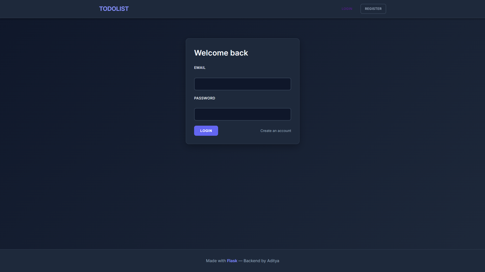

# 📝 TodoList Web Application

A modern, feature-rich todo list application built with Flask and PostgreSQL.

## ✨ Features

- 🔐 User Authentication (Register/Login/Logout)
- ✅ Add, View, and Delete Tasks
- 🔄 Toggle Task Status (Pending → Working → Completed)
- 🎨 Modern Dark Theme UI
- 📱 Fully Responsive Design
- 🔒 Secure Password Hashing

## 🛠️ Tech Stack

**Backend:**
- Flask (Python Web Framework)
- PostgreSQL (Database)
- Flask-SQLAlchemy (ORM)
- Flask-Login (Authentication)
- Werkzeug (Password Security)

**Frontend:**
- HTML5
- CSS3 (Custom Modern Design)
- Jinja2 Templates

## 📦 Installation

1. Clone the repository
```bash
git clone https://github.com/YOUR_USERNAME/todolist-flask.git
cd todolist-flask
```

2. Create virtual environment
```bash
python -m venv venv
source venv/bin/activate  # On Windows: venv\Scripts\activate
```

3. Install dependencies
```bash
pip install flask flask-sqlalchemy flask-login flask-wtf email-validator psycopg2-binary
```

4. Setup PostgreSQL Database
- Create a database named `todo_db`
- Update database URI in `app/__init__.py`

5. Run the application
```bash
python run.py
```

6. Open browser: `http://localhost:5000`

## 📸 Screenshots




## 🚀 Future Enhancements

- Add task priorities
- Task categories/tags
- Due dates and reminders
- Search and filter functionality
- Export tasks to CSV

## 👨‍�💻 Author

**Aditya Sharma**
- LinkedIn: [(https://www.linkedin.com/in/adityas2003/)]
